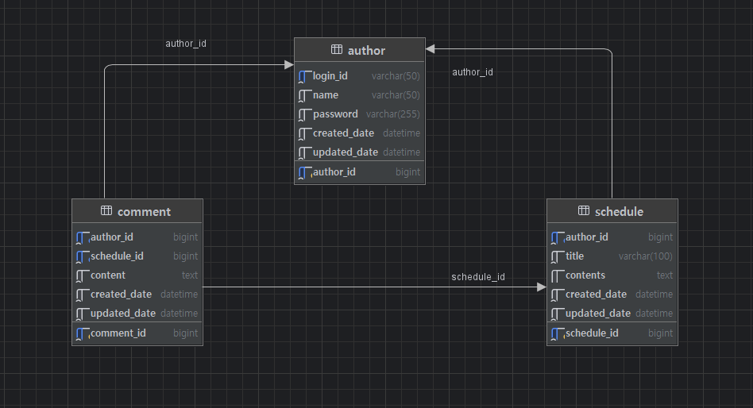

# 🍃 schedulerJPA

## 📌 ERD설계

## 📄 일정 관리 API 명세서

### 일정 관련

| 기능            | Method | URL                                 | Request (JSON) | Response (JSON) | 상태 코드 |
|-----------------|--------|--------------------------------------|----------------|------------------|-----------|
| **일정 생성**     | POST   | `/schedules`                         | `{ "title": "회의", "content": "팀 미팅" }` | `{ "id": 1, "title": "회의", "content": "팀 미팅", "date": "2025-03-20", "create_date": "2025-03-19T12:00:00", "update_date": "2025-03-19T12:00:00" }` | 201 Created |
| 일정 전체 조회   | GET    | `/schedules`                         | -              | `[ { "title": "회의", "content": "팀 미팅", "updatedDate": "2025-03-20", "name": "홍길동" } ]` | 200 OK |
| 일정 페이징 조회 | GET    | `/schedules/paged?page=0&size=10`   | -              | `[ { "title": "회의", "content": "팀 미팅", "updatedDate": "2025-03-20", "name": "홍길동" } ]` | 200 OK / 빈 배열 |
| 일정 단건 조회   | GET    | `/schedules/{scheduleId}`           | -              | `{ "title": "회의", "content": "팀 미팅", "date": "2025-03-20", "create_date": "2025-03-19T12:00:00", "update_date": "2025-03-19T12:00:00" }` | 200 OK |
| 일정 수정       | PATCH  | `/schedules/{scheduleId}`           | `{ "title": "변경된 제목", "content": "변경된 내용" }` | `{ "title": "변경된 제목", "content": "변경된 내용", "updatedDate": "2025-03-21", "name": "홍길동" }` | 200 OK / 401 / 403 / 404 |
| 일정 삭제       | DELETE | `/schedules/{scheduleId}`           | -              | -                | 200 OK / 401 / 404 |

---

### 작성자 관련

| 기능          | Method | URL                                 | Request (JSON) | Response (JSON) | 상태 코드 |
|---------------|--------|--------------------------------------|----------------|------------------|-----------|
| **작성자 등록** | POST   | `/authors/signup`                   | `{ "loginId": "hong123", "name": "홍길동", "password": "1234" }` | `{ "id": 1, "loginId": "hong123", "name": "홍길동", "createdDate": "2025-03-20", "updatedDate": "2025-03-21" }` | 201 Created |
| 작성자 조회     | GET    | `/authors/{authorId}`               | -              | `{ "authorId": 1, "loginId": "hong123", "name": "홍길동", "createdDate": "2025-03-20", "updatedDate": "2025-03-21" }` | 200 OK |
| 작성자 수정     | PATCH  | `/authors/{authorId}`               | `{ "name": "수정된 이름", "password": "1234" }` | `{ "authorId": 1, "loginId": "hong123", "name": "수정된 이름", "updatedDate": "2025-03-21" }` | 200 OK / 400 / 404 |
| 작성자 삭제     | DELETE | `/authors/{authorId}`               | -              | -                | 200 OK / 404 |

---

### 로그인 관련

| 기능      | Method | URL              | Request (JSON) | Response (JSON) | 상태 코드 |
|-----------|--------|-------------------|----------------|------------------|-----------|
| **로그인** | POST   | `/login`          | `{ "loginId": "hong123", "password": "1234" }` | `{ "authorId": 1, "loginId": "hong123", "name": "홍길동" }` | 200 OK / 401 |
| 로그아웃   | POST   | `/login/logout`   | -              | `"로그아웃 되었습니다."` | 200 OK / 401 |

---

### 댓글 관련

| 기능        | Method | URL                                                      | Request (JSON) | Response (JSON) | 상태 코드 |
|-------------|--------|-----------------------------------------------------------|----------------|------------------|-----------|
| **댓글 작성** | POST   | `/comments/schedules/{scheduleId}`                       | `{ "content": "좋은 일정입니다!" }` | `{ "commentId": 1, "content": "좋은 일정입니다!", "author": "홍길동" }` | 200 OK |
| 댓글 전체 조회 | GET    | `/comments/schedules/{scheduleId}`                       | -              | `[ { "commentId": 1, "content": "좋은 일정입니다!", "author": "홍길동" } ]` | 200 OK |
| 댓글 수정     | PATCH  | `/comments/schedules/{scheduleId}/{commentId}`           | `{ "content": "수정된 댓글입니다." }` | `{ "commentId": 1, "content": "수정된 댓글입니다.", "author": "홍길동" }` | 200 OK / 403 / 404 |
| 댓글 삭제     | DELETE | `/comments/schedules/{scheduleId}/{commentId}`           | -              | -                | 200 OK / 403 / 404 |

## 에러 코드 명세서

| 도메인   | 에러 코드       | 메시지                              | 상태 코드 |
|----------|------------------|--------------------------------------|------------|
| AUTHOR   | AUTHOR_001       | 작성자를 찾을 수 없습니다.           | 404        |
|          | AUTHOR_002       | 이름과 이메일을 입력해주세요.        | 400        |
|          | AUTHOR_003       | 작성자 수정에 실패했습니다.          | 404        |
|          | AUTHOR_004       | 작성자 삭제에 실패했습니다.          | 404        |
|          | AUTHOR_005       | 이미 사용 중인 로그인 ID입니다.      | 409        |
| SCHEDULE | SCHEDULE_001     | 존재하지 않는 일정입니다.            | 404        |
|          | SCHEDULE_002     | 제목과 내용을 입력해주세요.          | 400        |
|          | SCHEDULE_003     | 일정 수정 실패                      | 404        |
|          | SCHEDULE_004     | 일정 삭제 실패                      | 404        |
|          | SCHEDULE_005     | 존재하지 않는 일정 입니다.           | 401        |
| AUTH     | AUTH_001         | 작성자만 일정을 수정할 수 있습니다.   | 403        |
|          | AUTH_002         | 비밀번호가 일치하지 않습니다.         | 401        |
|          | AUTH_003         | 아이디가 일치하지 않습니다.           | 401        |
|          | AUTH_004         | 존재하지 않는 로그인 ID입니다.        | 401        |
|          | AUTH_005         | 이미 로그아웃된 상태입니다.           | 401        |
| COMMENT  | COMMENT_001      | 존재하지 않는 댓글입니다.            | 404        |
|          | COMMENT_002      | 내용을 입력해주세요.                 | 400        |
|          | COMMENT_003      | 댓글 수정 실패                      | 404        |
|          | COMMENT_004      | 댓글 삭제 실패                      | 404        |
| COMMON   | COMMON_001       | 요청한 페이지 범위가 유효하지 않습니다. | 400        |
---
## 💡사용 기술
- **Spring Boot 3.4.3**
- **Java 21**
- **MySQL**
- **Gradle**
- **JPA**
- **Postman**
---

## 🔢레벨 별 branch 구현
### ✅ 필수
#### 1️⃣ Lv 1. 일정 CRUD
#### 2️⃣ Lv 2. 유저 CRUD
#### 3️⃣ Lv 3. 회원가입
#### 4️⃣ Lv 4. 로그인(인증)

---
## 🔥도전
#### 5️⃣ Lv 5. 다양한 예외처리 적용하기
#### 6️⃣ Lv 6. 비밀번호 암호화
#### 7️⃣ Lv 7. 댓글 CRUD
#### 8️⃣ Lv 8. 일정 페이징 조회
---
## 😎 추가 구현